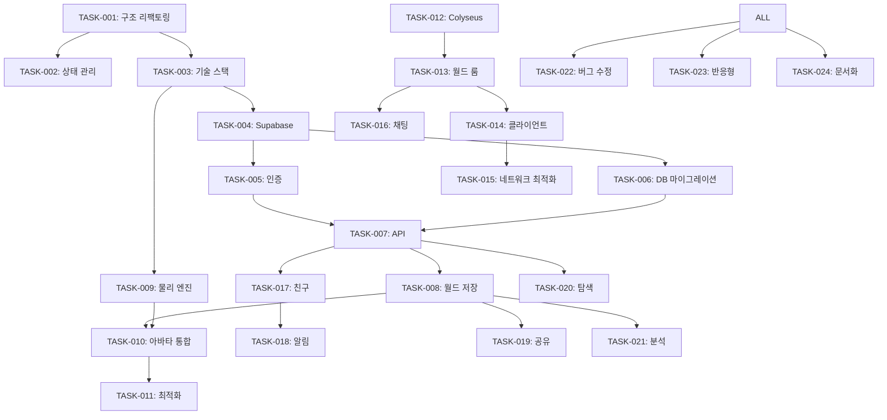

# 📋 Flux Studio 메타버스 플랫폼 - 태스크 분해

## 🎯 프로젝트 목표
확장 가능한 메타버스 플랫폼으로 전환하여 사용자가 월드를 만들고 공유하며, 아바타로 다른 사람의 월드를 방문할 수 있는 시스템 구축

---

## 📊 Phase 0: 아키텍처 준비 (2주)

### 🏗️ TASK-001: 프로젝트 구조 리팩토링
**우선순위**: 🔴 Critical  
**예상 시간**: 3일  
**담당**: Frontend Developer  
**의존성**: 없음

**서브 태스크**:
- [ ] 001-1: 현재 코드베이스 분석 및 문서화 (4h)
- [ ] 001-2: 새로운 폴더 구조 설계 (2h)
  ```
  src/
  ├── core/          # 핵심 시스템
  ├── features/      # 기능별 모듈
  ├── shared/        # 공유 컴포넌트
  └── pages/         # 페이지
  ```
- [ ] 001-3: 파일 이동 및 import 경로 수정 (8h)
- [ ] 001-4: ESLint/Prettier 규칙 업데이트 (2h)
- [ ] 001-5: 테스트 환경 설정 (4h)

### 🔧 TASK-002: 상태 관리 통합
**우선순위**: 🔴 Critical  
**예상 시간**: 2일  
**담당**: Frontend Developer  
**의존성**: TASK-001

**서브 태스크**:
- [ ] 002-1: Zustand 글로벌 스토어 설계 (4h)
- [ ] 002-2: 현재 localStorage 기반 저장소 마이그레이션 (6h)
- [ ] 002-3: 상태 동기화 로직 구현 (4h)
- [ ] 002-4: DevTools 설정 (2h)

### 📚 TASK-003: 기술 스택 설정
**우선순위**: 🟡 High  
**예상 시간**: 2일  
**담당**: Full Stack Developer  
**의존성**: TASK-001

**서브 태스크**:
- [ ] 003-1: 필요 패키지 설치 (2h)
  - Supabase, NextAuth, Colyseus, Rapier
- [ ] 003-2: 환경 변수 설정 (.env.local, .env.production) (1h)
- [ ] 003-3: TypeScript 타입 정의 파일 생성 (4h)
- [ ] 003-4: 개발 도구 설정 (VSCode, Chrome 확장) (1h)

---

## 📊 Phase 1: 인증 & 데이터베이스 (2주)

### 🔐 TASK-004: Supabase 프로젝트 설정
**우선순위**: 🔴 Critical  
**예상 시간**: 1일  
**담당**: Backend Developer  
**의존성**: TASK-003

**서브 태스크**:
- [ ] 004-1: Supabase 프로젝트 생성 (1h)
- [ ] 004-2: 데이터베이스 스키마 설계 (3h)
- [ ] 004-3: RLS (Row Level Security) 정책 설정 (2h)
- [ ] 004-4: 저장소 버킷 생성 (아바타, 월드 썸네일) (1h)
- [ ] 004-5: Edge Functions 설정 (1h)

### 👤 TASK-005: 사용자 인증 시스템
**우선순위**: 🔴 Critical  
**예상 시간**: 3일  
**담당**: Full Stack Developer  
**의존성**: TASK-004

**서브 태스크**:
- [ ] 005-1: NextAuth.js 설정 (4h)
- [ ] 005-2: OAuth 프로바이더 통합 (Google, Discord) (6h)
- [ ] 005-3: 이메일/비밀번호 인증 구현 (4h)
- [ ] 005-4: 세션 관리 및 JWT 토큰 설정 (4h)
- [ ] 005-5: 보호된 라우트 구현 (middleware.ts) (4h)
- [ ] 005-6: 로그인/회원가입 UI 제작 (4h)

### 💾 TASK-006: 데이터베이스 마이그레이션
**우선순위**: 🟡 High  
**예상 시간**: 3일  
**담당**: Backend Developer  
**의존성**: TASK-004

**서브 태스크**:
- [ ] 006-1: 사용자 테이블 생성 (2h)
- [ ] 006-2: 아바타 테이블 생성 (2h)
- [ ] 006-3: 월드 테이블 생성 (3h)
- [ ] 006-4: 관계 설정 및 인덱스 최적화 (3h)
- [ ] 006-5: 시드 데이터 작성 (2h)
- [ ] 006-6: 마이그레이션 스크립트 작성 (4h)

### 🔌 TASK-007: API 라우트 구현
**우선순위**: 🟡 High  
**예상 시간**: 4일  
**담당**: Backend Developer  
**의존성**: TASK-005, TASK-006

**서브 태스크**:
- [ ] 007-1: 사용자 CRUD API (/api/users) (4h)
- [ ] 007-2: 아바타 관리 API (/api/avatars) (6h)
- [ ] 007-3: 월드 CRUD API (/api/worlds) (6h)
- [ ] 007-4: 파일 업로드 API (presigned URLs) (4h)
- [ ] 007-5: API 문서화 (Swagger/OpenAPI) (4h)
- [ ] 007-6: API 테스트 작성 (8h)

---

## 📊 Phase 2: 월드 시스템 통합 (3주)

### 🌍 TASK-008: 월드 저장 시스템 리팩토링
**우선순위**: 🔴 Critical  
**예상 시간**: 3일  
**담당**: Full Stack Developer  
**의존성**: TASK-007

**서브 태스크**:
- [ ] 008-1: localStorage → Supabase 마이그레이션 스크립트 (6h)
- [ ] 008-2: 월드 데이터 압축 및 최적화 (GZIP) (4h)
- [ ] 008-3: 버전 관리 시스템 구현 (4h)
- [ ] 008-4: 백업 및 복구 기능 (4h)
- [ ] 008-5: 월드 임포트/익스포트 기능 (6h)

### 🏃 TASK-009: 물리 엔진 통합
**우선순위**: 🔴 Critical  
**예상 시간**: 5일  
**담당**: 3D Developer  
**의존성**: TASK-003

**서브 태스크**:
- [ ] 009-1: @react-three/rapier 설치 및 설정 (2h)
- [ ] 009-2: 정적 오브젝트 충돌체 생성 시스템 (8h)
- [ ] 009-3: 아바타 캐릭터 컨트롤러 구현 (12h)
- [ ] 009-4: 충돌 감지 및 응답 시스템 (8h)
- [ ] 009-5: 성능 최적화 (충돌체 간소화) (8h)
- [ ] 009-6: 디버그 뷰어 구현 (2h)

### 🎮 TASK-010: 아바타-월드 통합
**우선순위**: 🔴 Critical  
**예상 시간**: 4일  
**담당**: Game Developer  
**의존성**: TASK-008, TASK-009

**서브 태스크**:
- [ ] 010-1: 아바타 스폰 시스템 구현 (4h)
- [ ] 010-2: 3인칭 카메라 컨트롤 (6h)
- [ ] 010-3: 입력 시스템 (키보드/마우스/터치) (6h)
- [ ] 010-4: 애니메이션 시스템 (걷기/달리기/점프) (8h)
- [ ] 010-5: 아바타-오브젝트 상호작용 (E키) (6h)
- [ ] 010-6: 아바타 커스터마이징 적용 (4h)

### 🔄 TASK-011: 월드 로딩 최적화
**우선순위**: 🟡 High  
**예상 시간**: 3일  
**담당**: Performance Engineer  
**의존성**: TASK-010

**서브 태스크**:
- [ ] 011-1: Progressive 월드 로딩 구현 (6h)
- [ ] 011-2: LOD (Level of Detail) 시스템 (8h)
- [ ] 011-3: 텍스처 압축 및 최적화 (4h)
- [ ] 011-4: 오브젝트 인스턴싱 구현 (4h)
- [ ] 011-5: 로딩 화면 UX 개선 (2h)

---

## 📊 Phase 3: 실시간 멀티플레이어 (3주)

### 🖥️ TASK-012: Colyseus 서버 설정
**우선순위**: 🔴 Critical  
**예상 시간**: 2일  
**담당**: Backend Developer  
**의존성**: 없음

**서브 태스크**:
- [ ] 012-1: Colyseus 서버 프로젝트 생성 (2h)
- [ ] 012-2: 개발/프로덕션 환경 설정 (2h)
- [ ] 012-3: 도커 컨테이너화 (4h)
- [ ] 012-4: PM2 프로세스 관리 설정 (2h)
- [ ] 012-5: 모니터링 설정 (Grafana) (6h)

### 🎯 TASK-013: 월드 룸 구현
**우선순위**: 🔴 Critical  
**예상 시간**: 5일  
**담당**: Multiplayer Developer  
**의존성**: TASK-012

**서브 태스크**:
- [ ] 013-1: WorldRoom 클래스 구현 (8h)
- [ ] 013-2: 플레이어 상태 관리 (position, rotation) (6h)
- [ ] 013-3: 월드 오브젝트 동기화 (8h)
- [ ] 013-4: 메시지 핸들링 (move, chat, interact) (6h)
- [ ] 013-5: 룸 라이프사이클 관리 (join/leave) (4h)
- [ ] 013-6: 룸 인스턴스 자동 스케일링 (8h)

### 🔗 TASK-014: 클라이언트 네트워킹
**우선순위**: 🔴 Critical  
**예상 시간**: 4일  
**담당**: Frontend Developer  
**의존성**: TASK-013

**서브 태스크**:
- [ ] 014-1: Colyseus 클라이언트 통합 (4h)
- [ ] 014-2: 상태 동기화 로직 구현 (8h)
- [ ] 014-3: 클라이언트 예측 및 보간 (10h)
- [ ] 014-4: 연결 관리 (재연결, 타임아웃) (6h)
- [ ] 014-5: 오프라인 모드 지원 (4h)

### 📡 TASK-015: 실시간 최적화
**우선순위**: 🟡 High  
**예상 시간**: 3일  
**담당**: Performance Engineer  
**의존성**: TASK-014

**서브 태스크**:
- [ ] 015-1: 네트워크 대역폭 최적화 (6h)
- [ ] 015-2: 상태 압축 (MessagePack) (4h)
- [ ] 015-3: Delta 업데이트 구현 (6h)
- [ ] 015-4: 지역별 서버 라우팅 (4h)
- [ ] 015-5: 부하 테스트 (100명 동시접속) (4h)

---

## 📊 Phase 4: 소셜 기능 (2주)

### 💬 TASK-016: 채팅 시스템
**우선순위**: 🟡 High  
**예상 시간**: 3일  
**담당**: Full Stack Developer  
**의존성**: TASK-013

**서브 태스크**:
- [ ] 016-1: 채팅 UI 컴포넌트 제작 (4h)
- [ ] 016-2: 실시간 메시지 전송 구현 (4h)
- [ ] 016-3: 채팅 필터링 (욕설 필터) (4h)
- [ ] 016-4: 이모티콘 지원 (2h)
- [ ] 016-5: 채팅 기록 저장 (Redis) (4h)
- [ ] 016-6: 거리 기반 채팅 (local chat) (6h)

### 👥 TASK-017: 친구 시스템
**우선순위**: 🟡 High  
**예상 시간**: 4일  
**담당**: Full Stack Developer  
**의존성**: TASK-007

**서브 태스크**:
- [ ] 017-1: 친구 추가/삭제 API (4h)
- [ ] 017-2: 친구 목록 UI 제작 (6h)
- [ ] 017-3: 온라인 상태 표시 (실시간) (6h)
- [ ] 017-4: 친구 초대 기능 (4h)
- [ ] 017-5: 알림 시스템 통합 (6h)
- [ ] 017-6: 친구와 함께하기 기능 (6h)

### 🔔 TASK-018: 알림 시스템
**우선순위**: 🟢 Medium  
**예상 시간**: 2일  
**담당**: Frontend Developer  
**의존성**: TASK-017

**서브 태스크**:
- [ ] 018-1: 인앱 알림 컴포넌트 (4h)
- [ ] 018-2: 푸시 알림 설정 (PWA) (4h)
- [ ] 018-3: 알림 설정 UI (2h)
- [ ] 018-4: 알림 기록 저장 (2h)
- [ ] 018-5: 알림 필터링 (4h)

---

## 📊 Phase 5: 월드 공유 & 탐색 (2주)

### 🔗 TASK-019: 월드 공유 기능
**우선순위**: 🟡 High  
**예상 시간**: 3일  
**담당**: Full Stack Developer  
**의존성**: TASK-008

**서브 태스크**:
- [ ] 019-1: 공유 링크 생성 시스템 (4h)
- [ ] 019-2: QR 코드 생성 기능 (2h)
- [ ] 019-3: 공유 권한 설정 UI (4h)
- [ ] 019-4: 단축 URL 서비스 구현 (4h)
- [ ] 019-5: 공유 통계 추적 (4h)
- [ ] 019-6: SNS 공유 통합 (6h)

### 🔍 TASK-020: 월드 탐색 페이지
**우선순위**: 🟡 High  
**예상 시간**: 4일  
**담당**: Frontend Developer  
**의존성**: TASK-007

**서브 태스크**:
- [ ] 020-1: 월드 목록 UI 디자인 (6h)
- [ ] 020-2: 필터 및 정렬 기능 (6h)
- [ ] 020-3: 검색 기능 구현 (Algolia) (6h)
- [ ] 020-4: 월드 프리뷰 (썸네일, 영상) (6h)
- [ ] 020-5: 무한 스크롤 구현 (4h)
- [ ] 020-6: 월드 상세 정보 모달 (4h)

### 📊 TASK-021: 월드 분석 대시보드
**우선순위**: 🟢 Medium  
**예상 시간**: 3일  
**담당**: Frontend Developer  
**의존성**: TASK-008

**서브 태스크**:
- [ ] 021-1: 방문자 통계 차트 (6h)
- [ ] 021-2: 실시간 모니터링 뷰 (6h)
- [ ] 021-3: 수익 리포트 (4h)
- [ ] 021-4: 사용자 피드백 수집 (4h)
- [ ] 021-5: 데이터 CSV 내보내기 (4h)

---

## 📊 Phase 6: MVP 마무리 (1주)

### 🐛 TASK-022: 버그 수정 및 안정화
**우선순위**: 🔴 Critical  
**예상 시간**: 3일  
**담당**: All Team  
**의존성**: 모든 태스크

**서브 태스크**:
- [ ] 022-1: 버그 리포트 수집 및 분류 (4h)
- [ ] 022-2: Critical 버그 수정 (12h)
- [ ] 022-3: 성능 이슈 해결 (8h)
- [ ] 022-4: 보안 취약점 점검 (OWASP) (8h)
- [ ] 022-5: 크로스 브라우저 테스트 (4h)

### 📱 TASK-023: 반응형 디자인
**우선순위**: 🟡 High  
**예상 시간**: 2일  
**담당**: UI/UX Developer  
**의존성**: 없음

**서브 태스크**:
- [ ] 023-1: 모바일 레이아웃 최적화 (8h)
- [ ] 023-2: 태블릿 UI 조정 (4h)
- [ ] 023-3: 터치 인터페이스 개선 (4h)
- [ ] 023-4: PWA 매니페스트 설정 (2h)

### 📚 TASK-024: 문서화 및 가이드
**우선순위**: 🟡 High  
**예상 시간**: 2일  
**담당**: Technical Writer  
**의존성**: 없음

**서브 태스크**:
- [ ] 024-1: 사용자 가이드 작성 (6h)
- [ ] 024-2: API 문서 완성 (4h)
- [ ] 024-3: 튜토리얼 월드 제작 (4h)
- [ ] 024-4: FAQ 작성 (2h)
- [ ] 024-5: 비디오 튜토리얼 제작 (8h)

---

## 📈 우선순위 매트릭스

### 🔴 Critical (즉시 시작)
- TASK-001: 프로젝트 구조 리팩토링
- TASK-002: 상태 관리 통합
- TASK-004: Supabase 프로젝트 설정
- TASK-005: 사용자 인증 시스템
- TASK-008: 월드 저장 시스템
- TASK-009: 물리 엔진 통합
- TASK-010: 아바타-월드 통합
- TASK-012: Colyseus 서버 설정
- TASK-013: 월드 룸 구현
- TASK-014: 클라이언트 네트워킹

### 🟡 High (순차적 진행)
- TASK-003: 기술 스택 설정
- TASK-006: 데이터베이스 마이그레이션
- TASK-007: API 라우트 구현
- TASK-011: 월드 로딩 최적화
- TASK-015: 실시간 최적화
- TASK-016: 채팅 시스템
- TASK-017: 친구 시스템
- TASK-019: 월드 공유 기능
- TASK-020: 월드 탐색 페이지

### 🟢 Medium (MVP 이후)
- TASK-018: 알림 시스템
- TASK-021: 월드 분석 대시보드

---

## 🎯 마일스톤

### M1: 기반 구축 (4주)
**목표**: 인증된 사용자가 자신의 월드를 클라우드에 저장할 수 있음
- 프로젝트 구조 완성
- 인증 시스템 완료
- 데이터베이스 구축
- API 구현

### M2: 핵심 기능 (6주)
**목표**: 아바타로 자신의 월드에서 이동할 수 있음
- 월드-아바타 통합
- 물리 엔진 작동
- 기본 상호작용

### M3: 멀티플레이어 (4주)
**목표**: 다른 사람과 함께 월드에서 만날 수 있음
- 실시간 서버 구축
- 멀티플레이어 동기화
- 채팅 시스템

### M4: 소셜 플랫폼 (2주)
**목표**: 다른 사람의 월드를 방문할 수 있음
- 친구 시스템
- 월드 공유
- 월드 탐색

### M5: MVP 출시 (1주)
**목표**: 안정적인 서비스 출시
- 버그 수정
- 성능 최적화
- 문서화

---

## 👥 팀 구성 제안

### 필수 인력 (5명)
1. **Full Stack Developer** (2명)
   - Frontend (React, Three.js)
   - Backend (Node.js, Supabase)
   
2. **3D/Game Developer** (1명)
   - Three.js, React Three Fiber
   - 물리 엔진 (Rapier)
   - 애니메이션
   
3. **Multiplayer Developer** (1명)
   - Colyseus
   - WebRTC
   - 네트워크 최적화
   
4. **UI/UX Designer** (1명)
   - Figma 디자인
   - 반응형 레이아웃
   - 사용자 경험

### 선택 인력 (3명)
5. **DevOps Engineer**
   - AWS/Vercel
   - CI/CD
   - 모니터링

6. **QA Tester**
   - 테스트 시나리오
   - 버그 리포팅
   - 성능 테스트

7. **Community Manager**
   - 베타 테스터 관리
   - 피드백 수집
   - 콘텐츠 큐레이션

---

## 📝 리스크 및 대응 방안

### 기술적 리스크

#### 1. 성능 이슈
- **리스크**: 많은 오브젝트/사용자 시 프레임 드롭
- **대응**: 
  - LOD 시스템 구현
  - 오브젝트 컬링
  - WebWorker 활용
  - 점진적 로딩

#### 2. 확장성 문제
- **리스크**: 동시 접속자 증가 시 서버 과부하
- **대응**:
  - 마이크로서비스 아키텍처
  - 자동 스케일링
  - 로드 밸런싱
  - 캐싱 전략

#### 3. 보안 취약점
- **리스크**: 사용자 데이터 유출, 해킹
- **대응**:
  - 정기 보안 감사
  - OWASP 가이드라인
  - 침투 테스트
  - 암호화 강화

### 비즈니스 리스크

#### 1. 사용자 확보
- **리스크**: 초기 사용자 부족
- **대응**:
  - 베타 테스트 프로그램
  - 인플루언서 마케팅
  - 무료 크레딧 제공
  - 커뮤니티 이벤트

#### 2. 수익 모델
- **리스크**: 수익화 실패
- **대응**:
  - 프리미엄 기능
  - 가상 화폐
  - 광고 모델
  - B2B 라이선스

---

## 🚀 성공 지표 (KPI)

### 기술 지표
- 페이지 로드 시간 < 3초
- 평균 FPS > 50
- 서버 응답 시간 < 100ms
- 동시 접속자 > 100명/월드

### 비즈니스 지표
- MAU (월간 활성 사용자) > 10,000
- 일일 생성 월드 수 > 100
- 평균 세션 시간 > 20분
- 유료 전환율 > 5%

### 사용자 만족도
- NPS 점수 > 40
- 앱스토어 평점 > 4.5
- 재방문율 > 60%
- 추천 의향 > 70%

---

## 📅 타임라인

### 전체 일정: 17주 (약 4개월)

```
Week 1-2:   Phase 0 (아키텍처)
Week 3-4:   Phase 1 (인증/DB)
Week 5-7:   Phase 2 (월드 시스템)
Week 8-10:  Phase 3 (멀티플레이어)
Week 11-12: Phase 4 (소셜 기능)
Week 13-14: Phase 5 (공유/탐색)
Week 15:    Phase 6 (마무리)
Week 16-17: 베타 테스트 & 출시 준비
```

---

## 🔗 태스크 의존성 다이어그램



---

## 💡 개발 팁

1. **병렬 작업**: 백엔드와 프론트엔드 개발을 동시에 진행
2. **Mock 데이터**: API 완성 전 Mock 데이터로 프론트 개발
3. **Feature Flag**: 기능별 On/Off로 점진적 배포
4. **A/B 테스트**: 주요 기능은 A/B 테스트로 검증
5. **모니터링**: 초기부터 로깅과 모니터링 구축

---

이 태스크 분해를 Jira, Linear, Notion, 또는 GitHub Projects에서 관리하시면 됩니다.
각 태스크마다 구체적인 시간 추정과 담당자가 명시되어 있어 프로젝트 진행상황을 쉽게 추적할 수 있습니다! 🚀