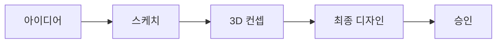

# 🎨 Object Development Plan - 상세 개발 계획

## 📋 목차
1. [개발 우선순위](#개발-우선순위)
2. [오브젝트 제작 파이프라인](#오브젝트-제작-파이프라인)
3. [기술 구현 상세](#기술-구현-상세)
4. [품질 기준](#품질-기준)
5. [제작 일정](#제작-일정)

---

## 🎯 개발 우선순위

### Phase 1: Essential Objects (필수 오브젝트) - 1개월
가장 기본적이고 자주 사용되는 오브젝트부터 개발

#### Week 1: Basic Furniture (기본 가구) - 25개
```
✅ 우선순위 1 (즉시 필요)
├── 의자 (5종)
│   ├── basic_chair - 기본 의자
│   ├── office_chair - 사무용 의자
│   ├── dining_chair - 식탁 의자
│   ├── gaming_chair - 게이밍 의자
│   └── stool - 스툴
├── 테이블 (5종)
│   ├── coffee_table - 커피 테이블
│   ├── dining_table - 식탁
│   ├── desk - 책상
│   ├── side_table - 사이드 테이블
│   └── conference_table - 회의 테이블
├── 소파 (5종)
│   ├── sofa_2seat - 2인용 소파
│   ├── sofa_3seat - 3인용 소파
│   ├── sofa_L - L자 소파
│   ├── armchair - 안락의자
│   └── bean_bag - 빈백
├── 수납 (5종)
│   ├── bookshelf - 책장
│   ├── cabinet - 캐비닛
│   ├── drawer - 서랍장
│   ├── wardrobe - 옷장
│   └── shelf - 선반
└── 침대 (5종)
    ├── single_bed - 싱글 침대
    ├── double_bed - 더블 침대
    ├── bunk_bed - 이층 침대
    ├── sofa_bed - 소파베드
    └── futon - 이불/매트리스
```

#### Week 2: Architecture Elements (건축 요소) - 30개
```
✅ 우선순위 2 (공간 구성 필수)
├── 벽 (10종)
│   ├── wall_plain - 기본 벽
│   ├── wall_window - 창문 있는 벽
│   ├── wall_glass - 유리 벽
│   ├── wall_brick - 벽돌 벽
│   ├── wall_wood - 나무 벽
│   ├── wall_concrete - 콘크리트 벽
│   ├── wall_partition - 파티션
│   ├── wall_curved - 곡선 벽
│   ├── wall_half - 반쪽 벽
│   └── wall_decorative - 장식 벽
├── 문 (10종)
│   ├── door_single - 싱글 도어
│   ├── door_double - 더블 도어
│   ├── door_sliding - 슬라이딩 도어
│   ├── door_glass - 유리문
│   ├── door_auto - 자동문
│   ├── door_revolving - 회전문
│   ├── door_french - 프렌치 도어
│   ├── door_barn - 헛간문 스타일
│   ├── door_security - 보안문
│   └── door_emergency - 비상문
├── 바닥/천장 (5종)
│   ├── floor_wood - 나무 바닥
│   ├── floor_tile - 타일 바닥
│   ├── floor_carpet - 카펫 바닥
│   ├── ceiling_plain - 기본 천장
│   └── ceiling_decorative - 장식 천장
└── 계단 (5종)
    ├── stairs_straight - 직선 계단
    ├── stairs_L - L자 계단
    ├── stairs_U - U자 계단
    ├── stairs_spiral - 나선 계단
    └── ramp - 경사로
```

#### Week 3: Lighting & Decoration (조명 & 장식) - 25개
```
✅ 우선순위 3 (분위기 연출)
├── 조명 (15종)
│   ├── light_ceiling - 천장등
│   ├── light_pendant - 펜던트 조명
│   ├── light_chandelier - 샹들리에
│   ├── light_spot - 스포트라이트
│   ├── light_floor - 플로어 램프
│   ├── light_table - 테이블 램프
│   ├── light_wall - 벽등
│   ├── light_strip - LED 스트립
│   ├── light_neon - 네온사인
│   ├── light_street - 가로등
│   ├── light_garden - 정원등
│   ├── light_stage - 무대 조명
│   ├── light_emergency - 비상등
│   ├── light_candle - 양초
│   └── light_lantern - 랜턴
└── 장식 (10종)
    ├── plant_pot - 화분
    ├── picture_frame - 액자
    ├── mirror - 거울
    ├── clock - 시계
    ├── rug - 러그
    ├── curtain - 커튼
    ├── vase - 꽃병
    ├── sculpture - 조각상
    ├── books - 책
    └── cushion - 쿠션
```

#### Week 4: Interactive Objects (상호작용 오브젝트) - 20개
```
✅ 우선순위 4 (사용자 경험)
├── 미디어 (10종)
│   ├── tv_wall - 벽걸이 TV
│   ├── tv_stand - 스탠드 TV
│   ├── monitor - 모니터
│   ├── projector - 프로젝터
│   ├── speaker - 스피커
│   ├── game_console - 게임 콘솔
│   ├── arcade_machine - 아케이드 기계
│   ├── jukebox - 주크박스
│   ├── radio - 라디오
│   └── phone - 전화기
└── 기능성 (10종)
    ├── vending_machine - 자판기
    ├── atm - ATM
    ├── elevator - 엘리베이터
    ├── escalator - 에스컬레이터
    ├── teleporter - 텔레포터
    ├── portal - 포털
    ├── switch - 스위치
    ├── button - 버튼
    ├── lever - 레버
    └── terminal - 터미널
```

### Phase 2: Expansion Pack (확장 팩) - 2개월

#### Month 2: Nature & Outdoor (자연 & 야외) - 50개
```
🌳 자연 오브젝트
├── 나무 (20종)
│   ├── 침엽수 (5종)
│   ├── 활엽수 (5종)
│   ├── 열대수 (5종)
│   └── 특수 나무 (5종)
├── 식물 (15종)
│   ├── 꽃 (8종)
│   ├── 관목 (4종)
│   └── 잔디/이끼 (3종)
├── 지형 요소 (10종)
│   ├── 바위 (5종)
│   └── 물 요소 (5종)
└── 야외 가구 (5종)
```

#### Month 3: Special & Advanced (특수 & 고급) - 50개
```
🎮 특수 오브젝트
├── 탈것 (15종)
│   ├── 자동차 (5종)
│   ├── 자전거 (5종)
│   └── 특수 탈것 (5종)
├── 판타지 (15종)
│   ├── 마법 아이템 (8종)
│   └── 판타지 구조물 (7종)
├── 사이버펑크 (10종)
└── 이벤트/축제 (10종)
```

---

## 🏭 오브젝트 제작 파이프라인

### 1. 컨셉 & 디자인


#### 디자인 원칙
- **일관성**: 동일한 아트 스타일 유지
- **모듈성**: 다른 오브젝트와 조합 가능
- **확장성**: 다양한 변형 가능
- **최적화**: 폴리곤 수 제한

### 2. 3D 모델링 규격

#### 폴리곤 제한
```
카테고리별 폴리곤 수:
- Small Props (소품): 100-500 폴리곤
- Furniture (가구): 500-2000 폴리곤
- Architecture (건축): 1000-5000 폴리곤
- Vehicles (탈것): 2000-8000 폴리곤
- Complex (복잡): 5000-15000 폴리곤
```

#### 텍스처 규격
```
텍스처 해상도:
- Small: 256x256
- Medium: 512x512
- Large: 1024x1024
- Hero: 2048x2048

텍스처 타입:
- Diffuse (Base Color)
- Normal Map
- Roughness/Metallic
- Ambient Occlusion (옵션)
```

### 3. 구현 프로세스

#### Step 1: 모델 제작
```typescript
// 오브젝트 정의 구조
interface ObjectDefinition {
  id: string
  category: ObjectCategory
  metadata: {
    name: string
    description: string
    tags: string[]
    author: string
    version: string
  }
  model: {
    geometry: GeometryData
    materials: MaterialData[]
    animations?: AnimationData[]
  }
  physics: {
    collider: ColliderType
    mass?: number
    static: boolean
  }
  interaction: {
    type: InteractionType[]
    scripts?: InteractionScript[]
  }
  variants?: ObjectVariant[]
}
```

#### Step 2: 컴포넌트 생성
```typescript
// React Three Fiber 컴포넌트
export function ChairObject({ 
  position, 
  rotation, 
  scale, 
  variant = 'default',
  onInteract 
}: ObjectProps) {
  const { scene } = useGLTF('/models/furniture/chair.glb')
  const [hovered, setHovered] = useState(false)
  
  return (
    <group 
      position={position}
      rotation={rotation}
      scale={scale}
    >
      <primitive 
        object={scene}
        onPointerOver={() => setHovered(true)}
        onPointerOut={() => setHovered(false)}
        onClick={onInteract}
      />
      {hovered && <OutlineEffect />}
    </group>
  )
}
```

#### Step 3: 속성 시스템
```typescript
// 동적 속성 정의
const chairProperties = {
  appearance: {
    material: {
      type: 'select',
      options: ['wood', 'metal', 'plastic', 'fabric'],
      default: 'wood'
    },
    color: {
      type: 'color',
      default: '#8B4513'
    },
    pattern: {
      type: 'select',
      options: ['none', 'stripes', 'dots', 'floral'],
      default: 'none'
    }
  },
  physics: {
    sittable: {
      type: 'boolean',
      default: true
    },
    weight: {
      type: 'number',
      min: 1,
      max: 50,
      default: 5
    }
  }
}
```

### 4. 최적화 전략

#### LOD 시스템
```typescript
// 거리별 모델 전환
const LODModels = {
  high: '/models/chair_high.glb',    // < 10m
  medium: '/models/chair_med.glb',   // 10-30m
  low: '/models/chair_low.glb',      // 30-50m
  billboard: '/textures/chair.png'   // > 50m
}
```

#### 인스턴싱
```typescript
// 동일 오브젝트 대량 렌더링
const ChairInstances = () => {
  const mesh = useRef()
  const { scene } = useGLTF('/models/chair.glb')
  
  const instances = useMemo(() => {
    const temp = new THREE.Object3D()
    const matrix = new THREE.Matrix4()
    const instances = []
    
    for (let i = 0; i < 100; i++) {
      temp.position.set(
        Math.random() * 100,
        0,
        Math.random() * 100
      )
      temp.updateMatrix()
      instances.push(temp.matrix.clone())
    }
    
    return instances
  }, [])
  
  return (
    <instancedMesh ref={mesh} args={[null, null, instances.length]}>
      <primitive object={scene.geometry} />
      <meshStandardMaterial />
    </instancedMesh>
  )
}
```

---

## 📏 품질 기준

### 1. 시각적 품질
- **일관된 아트 스타일**: Low-poly with smooth shading
- **색상 팔레트**: 제한된 색상 사용 (브랜드 가이드라인)
- **텍스처 품질**: 선명하고 타일링 없음
- **애니메이션**: 부드러운 60fps

### 2. 기술적 품질
- **성능**: 1000개 오브젝트 동시 렌더링 시 60fps
- **메모리**: 오브젝트당 평균 1-5MB
- **로딩 시간**: 개별 오브젝트 < 0.5초
- **호환성**: 모든 주요 브라우저 지원

### 3. 사용성 품질
- **직관적 배치**: 스냅 기능, 그리드 정렬
- **명확한 피드백**: 호버, 선택 상태 표시
- **다양한 옵션**: 최소 3가지 이상 변형
- **접근성**: 색맹 모드 지원

---

## 📅 제작 일정

### Month 1: Foundation (기초)
```
Week 1: 기본 가구 25개
- 3D 모델링: 3일
- 텍스처링: 2일
- 구현 & 테스트: 2일

Week 2: 건축 요소 30개
- 3D 모델링: 3일
- 텍스처링: 2일
- 구현 & 테스트: 2일

Week 3: 조명 & 장식 25개
- 3D 모델링: 3일
- 텍스처링: 2일
- 구현 & 테스트: 2일

Week 4: 상호작용 오브젝트 20개
- 3D 모델링: 2일
- 프로그래밍: 3일
- 통합 테스트: 2일
```

### Month 2-3: Expansion (확장)
```
Month 2: 자연 & 야외 50개
- 컨셉 디자인: 1주
- 3D 제작: 2주
- 구현 & 최적화: 1주

Month 3: 특수 & 고급 50개
- 컨셉 디자인: 1주
- 3D 제작: 2주
- 구현 & 최적화: 1주
```

### 리소스 필요
- **3D 아티스트**: 2명 (풀타임)
- **테크니컬 아티스트**: 1명 (파트타임)
- **프로그래머**: 1명 (풀타임)
- **QA 테스터**: 1명 (파트타임)

### 예산 추정
- **인건비**: $30,000/월 (3개월 = $90,000)
- **소프트웨어 라이선스**: $5,000
- **에셋 구매**: $5,000
- **총 예산**: $100,000

---

## 🚀 다음 단계

1. **즉시 시작 가능한 작업**
   - 기본 의자 5종 프로토타입 제작
   - 오브젝트 시스템 아키텍처 구현
   - 에디터 UI 개선

2. **준비가 필요한 작업**
   - 3D 아티스트 채용
   - 아트 스타일 가이드 확정
   - 제작 파이프라인 도구 셋업

3. **장기 계획**
   - 사용자 제작 오브젝트 지원
   - AI 기반 오브젝트 생성
   - 오브젝트 마켓플레이스

---

*이 계획은 MVP 출시를 목표로 하며, 사용자 피드백에 따라 우선순위가 조정될 수 있습니다.*