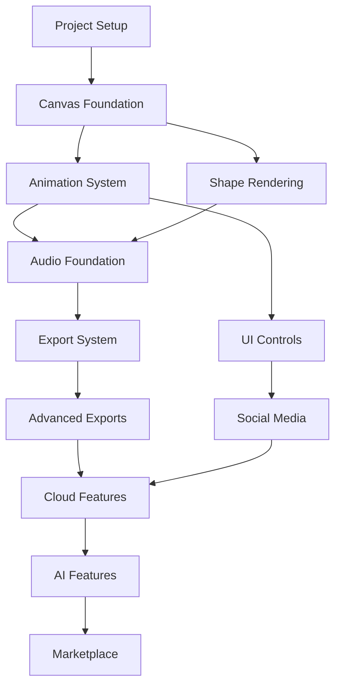

# Flux Studio - Task Breakdown Structure

## 📋 PHASE 1: MVP DEVELOPMENT (6-8 weeks)

### 1. Project Setup & Infrastructure

#### 1.1 Initialize Next.js Project

- [ ] Create Next.js 14 app with TypeScript
- [ ] Configure App Router structure
- [ ] Set up environment variables
- [ ] Initialize git repository

#### 1.2 Development Environment

- [ ] Configure TypeScript tsconfig.json
- [ ] Set up Tailwind CSS with custom theme
- [ ] Configure ESLint and Prettier
- [ ] Set up Husky for git hooks
- [ ] Create VS Code workspace settings

#### 1.3 Core Dependencies

- [ ] Install animation libraries (Framer Motion)
- [ ] Install state management (Zustand)
- [ ] Install Canvas/WebGL libraries
- [ ] Install audio libraries (Tone.js, Howler.js)
- [ ] Install UI component libraries

### 2. Canvas Animation Engine

#### 2.1 Canvas Foundation

- [ ] Create AnimationCanvas component
- [ ] Implement 60fps render loop
- [ ] Set up WebGL context fallback
- [ ] Create canvas resize handler
- [ ] Implement performance monitoring

#### 2.2 Basic Shapes & Rendering

- [ ] Implement circle renderer
- [ ] Implement line/network renderer
- [ ] Create particle system base
- [ ] Add gradient support
- [ ] Implement shape transformations

#### 2.3 Animation System

- [ ] Create timeline component
- [ ] Implement keyframe system
- [ ] Add easing functions
- [ ] Create animation presets
- [ ] Build play/pause/seek controls

### 3. Audio Engine Integration

#### 3.1 Audio Foundation

- [ ] Initialize Web Audio API context
- [ ] Create audio timeline component
- [ ] Implement audio track system
- [ ] Set up audio-visual sync
- [ ] Create volume/pan controls

#### 3.2 Sound Generation

- [ ] Implement synthesizer with Tone.js
- [ ] Create sound preset library
- [ ] Add MIDI input support
- [ ] Build effects rack (reverb, delay)
- [ ] Create audio visualization

#### 3.3 Audio Import/Export

- [ ] Implement audio file upload
- [ ] Create audio waveform display
- [ ] Add audio trimming tools
- [ ] Build audio export system
- [ ] Implement format conversion

### 4. Export System - Basic Formats

#### 4.1 Export Infrastructure

- [ ] Create plugin architecture base
- [ ] Implement export queue system
- [ ] Build progress tracking
- [ ] Create export settings UI
- [ ] Add export history

#### 4.2 Image Formats

- [ ] Implement PNG export
- [ ] Add JPEG export with quality
- [ ] Create WebP export
- [ ] Build batch frame export
- [ ] Add watermark option

#### 4.3 GIF Export

- [ ] Integrate gif.js library
- [ ] Create GIF optimization
- [ ] Add frame rate control
- [ ] Implement color reduction
- [ ] Build size preview

### 5. User Interface & Controls

#### 5.1 Layout & Navigation

- [ ] Create main dashboard layout
- [ ] Build responsive sidebar
- [ ] Implement toolbar system
- [ ] Add keyboard shortcuts
- [ ] Create context menus

#### 5.2 Control Panels

- [ ] Build properties panel
- [ ] Create layers panel
- [ ] Implement effects panel
- [ ] Add presets panel
- [ ] Build export panel

#### 5.3 User Experience

- [ ] Implement undo/redo system
- [ ] Add autosave functionality
- [ ] Create onboarding flow
- [ ] Build help system
- [ ] Add tooltips

## 📋 PHASE 2: EXTENDED FEATURES (4-6 weeks)

### 6. Advanced Export Formats

#### 6.1 Video Formats

- [ ] Implement MP4 export with MediaRecorder
- [ ] Add WebM export support
- [ ] Create quality presets
- [ ] Build audio track inclusion
- [ ] Add compression options

#### 6.2 Vector & Web Formats

- [ ] Implement SVG export
- [ ] Create Lottie export plugin
- [ ] Build CSS animation export
- [ ] Add sprite sheet generator
- [ ] Create HTML5 export

### 7. Social Media Optimization

#### 7.1 Platform Presets

- [ ] Create Instagram templates (Story, Post, Reel)
- [ ] Add TikTok video presets
- [ ] Build YouTube Shorts templates
- [ ] Create Twitter/X formats
- [ ] Add LinkedIn presets

#### 7.2 Auto-Optimization

- [ ] Implement auto-crop for platforms
- [ ] Add safe zone indicators
- [ ] Create file size optimizer
- [ ] Build format recommendations
- [ ] Add platform validation

### 8. Collaboration Features

#### 8.1 Project Management

- [ ] Create project save/load system
- [ ] Implement version control
- [ ] Build project templates
- [ ] Add project sharing
- [ ] Create project comments

#### 8.2 Cloud Integration

- [ ] Set up Supabase authentication
- [ ] Implement cloud storage
- [ ] Create project sync
- [ ] Build user profiles
- [ ] Add team workspaces

## 📋 PHASE 3: PREMIUM FEATURES (4-6 weeks)

### 9. AI-Powered Features

#### 9.1 AI Audio

- [ ] Integrate text-to-sound generation
- [ ] Add AI music composition
- [ ] Create smart sound effects
- [ ] Build audio style transfer
- [ ] Implement voice synthesis

#### 9.2 AI Animation

- [ ] Add motion prediction
- [ ] Create auto-animation
- [ ] Build style transfer
- [ ] Implement smart templates
- [ ] Add content-aware effects

### 10. Template Marketplace

#### 10.1 Marketplace Infrastructure

- [ ] Create marketplace backend
- [ ] Build template upload system
- [ ] Implement review process
- [ ] Add search and filters
- [ ] Create purchase system

#### 10.2 Creator Tools

- [ ] Build creator dashboard
- [ ] Add analytics system
- [ ] Create revenue tracking
- [ ] Implement payout system
- [ ] Add template versioning

## 📊 PRIORITY MATRIX

### CRITICAL PATH (Must complete in order):

1. 1.1 Initialize Next.js Project
2. 2.1 Canvas Foundation
3. 2.3 Animation System
4. 3.1 Audio Foundation
5. 4.1 Export Infrastructure
6. 4.3 GIF Export

### PARALLEL TASKS (Can be done simultaneously):

- 1.2 Development Environment & 1.3 Core Dependencies
- 2.2 Basic Shapes & 5.1 Layout
- 3.2 Sound Generation & 3.3 Audio Import
- 4.2 Image Formats & 5.2 Control Panels

## ⏱️ TIME ESTIMATES

- **Phase 1 - MVP**: 6-8 weeks
- **Phase 2 - Extended**: 4-6 weeks
- **Phase 3 - Premium**: 4-6 weeks
- **Total Project**: 14-20 weeks

## 🎯 SPRINT PLANNING

### Sprint 1 (Week 1-2): Foundation

- Project setup & infrastructure
- Canvas foundation
- Basic UI layout

### Sprint 2 (Week 3-4): Core Animation

- Shape rendering system
- Animation timeline
- Basic controls

### Sprint 3 (Week 5-6): Audio Integration

- Audio engine setup
- Sound generation
- Audio-visual sync

### Sprint 4 (Week 7-8): Export System

- Export infrastructure
- Basic formats (PNG, GIF)
- Export UI

### Sprint 5 (Week 9-10): Polish & Extended Features

- Video export
- Social media presets
- UX improvements

### Sprint 6 (Week 11-12): Advanced Features

- Cloud integration
- Collaboration tools
- Performance optimization

## 📝 TASK DEPENDENCIES

## 🚀 GETTING STARTED

1. **Immediate Actions**:
   - Set up development environment
   - Initialize Next.js project
   - Create project structure

2. **First Milestone** (2 weeks):
   - Working canvas with basic shapes
   - Simple animation playback
   - Basic UI structure

3. **MVP Target** (8 weeks):
   - Full animation creation
   - Audio integration
   - GIF/Image export
   - Polished UI
